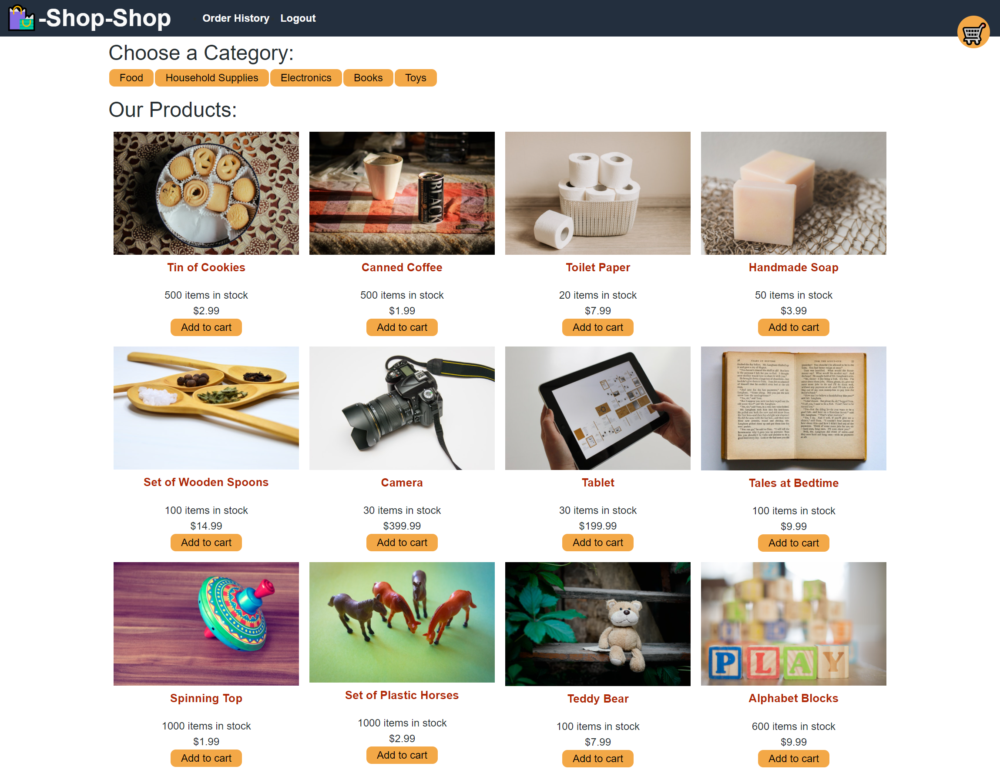

# **Redux MERN project Shop-Shop**

> ## **_Description_**

The Context API is quickly gaining traction as a worthy alternative or perhaps even successor to other libraries that manage global state in tandem with React, such as Flux or MobX. Nonetheless, the open-source JavaScript library Redux remains the industry standard for managing complex state in a large-scale React application, and it’s very likely that you’ll encounter it on the job.

---

### **_Table of Contents_**

- [Installation](#installation)
- [Usage](#usage)
- [Screen Shots](#Screen-shots)
- [Demo](#demo)
- [Features](#features)
- [Contribution](#contribution)
- [License](#license)

> ## **_Installation_**

```
npm start
```

> ## **_Usage_**

Here are some technologies used in the project.

- Node
- Express
- JSX
- Redux

> ## **_Screen-shots_**
>
> **`Wider Screen`**



> ## **_Demo_**

https://redux-mern-shop.herokuapp.com/

> ## **_Features_**

- UI updates
  - Cart
  - Sidebar
  - Navigation

> ## **_Contributing_**

Albert Jiang

❤️

If you created an application or package and would like other developers to contribute it, you will want to add guidelines for how to do so. The [Contributor Covenant](https://www.contributor-covenant.org/) is an industry standard, but you can always write your own.

> ## **_License_**


Copyright (c) [year] [fullname]

https://choosealicense.com/licenses/mit/
